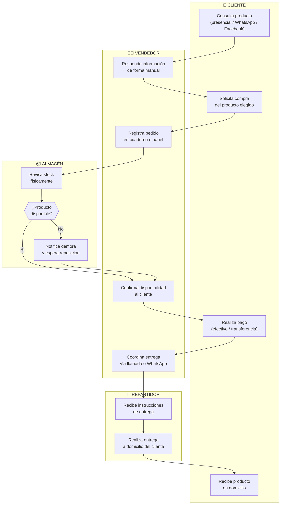

# **2\. Diagnóstico del proceso actual**

El diagnóstico del proceso es la fase analítica en la que el estado operativo de una organización es evaluado para comprender su funcionamiento interno y detectar oportunidades de mejora. Dado que no se cuenta con acceso directo a los flujos internos reales de Mueblería J & M, el proceso operativo fue reconstruido a partir de las prácticas habituales de negocios de similar tamaño y rubro en el contexto local de la ciudad de Arequipa.

## **2.1. Proceso de negocio en estudio actual (As-Is Process Map)**

Un mapa de proceso "As-Is" (tal como es) es la representación gráfica que detalla la forma exacta en la que las actividades de un negocio son ejecutadas en el presente. Para plasmar este modelo, se adoptó el formato de **diagrama de carriles (swimlane diagram)** con el objetivo de separar visualmente a cada actor involucrado y representar de manera clara la secuencia de actividades que forman el proceso logístico actual de Mueblería J & M.

### Diagrama de carriles del proceso de negocio

Este flujo abarca desde que el cliente consulta el producto hasta que lo recibe en su domicilio, incluyendo las decisiones y demoras que surgen de la gestión manual del negocio.

Figura 1. Proceso de gestión logística actual (pedido, inventario y entrega) de Mueblería J & M

### Diagrama de carriles de flujo principal del proceso de negocio

El flujo principal o "happy path" fue representado de forma aislada para ilustrar la ruta óptima y exitosa del proceso logístico. Este modelo fue diseñado de manera lineal y sin bifurcaciones, permitiendo visualizar la secuencia directa de actividades que conducen a la entrega satisfactoria del producto sin contratiempos.

Figura 2. Flujo principal del proceso de gestión logística de Mueblería J & M

## **2.2. Actores en el proceso**

Basado en el diagrama del proceso actual, los actores identificados son los siguientes:

* **Cliente:** Persona que inicia el proceso al consultar y solicitar la compra de un mueble. Puede interactuar a través de la tienda física, WhatsApp o Facebook.
* **Vendedor:** Encargado de responder consultas, registrar pedidos de forma manual, coordinar con el almacén y confirmar disponibilidad al cliente. Es el actor central del proceso y el principal punto de fallo cuando la información no está organizada.
* **Encargado de Almacén:** Responsable de verificar físicamente el stock disponible e informar al vendedor sobre la disponibilidad del producto. Opera sin apoyo de ningún sistema de inventario digital, lo que limita la precisión y rapidez de su respuesta.
* **Repartidor:** Actor responsable de ejecutar la entrega del producto al domicilio del cliente. Recibe instrucciones de forma verbal o por mensajes de WhatsApp, sin un sistema formal de planificación de rutas ni registro de entregas.

## **2.3. Personas involucradas en el proceso**

Las personas directamente involucradas y sus expectativas en el proceso son:

* **El cliente** busca recibir información clara y rápida sobre el producto, confirmar disponibilidad sin demoras y recibir su pedido en el plazo y horario acordado. Su principal frustración ocurre cuando hay demoras en la respuesta o cuando el producto no llega en el tiempo prometido.
* **El vendedor** necesita herramientas que le permitan registrar pedidos sin errores, consultar el estado del inventario en tiempo real y coordinar entregas sin tener que recurrir a múltiples llamadas o mensajes. Actualmente carga con la mayor parte de la gestión del proceso de forma informal.
* **El encargado de almacén** requiere visibilidad clara y actualizada del inventario disponible para evitar confirmaciones erróneas de stock. La ausencia de un sistema digital lo obliga a realizar conteos físicos repetitivos, un proceso lento y susceptible a error.
* **El repartidor** necesita información precisa sobre la dirección del cliente, el horario de entrega y el tipo de producto a transportar para cumplir con los tiempos establecidos. La coordinación informal genera confusiones en las rutas y retrasos en la entrega final.

## **2.4. Problemas, oportunidades o necesidades identificadas**

A partir del análisis del proceso actual de Mueblería J & M, se han detectado las siguientes fricciones principales con sus problemas asociados:

### **Fricciones identificadas:**

1. **Registro manual e informal de pedidos:** Los pedidos se registran en cuadernos o papeles sin una estructura definida, lo que facilita la pérdida de información y la duplicación de registros.

2. **Control de inventario sin visibilidad en tiempo real:** El encargado de almacén verifica el stock físicamente, sin ningún sistema digital de soporte, generando información desactualizada y confirmaciones erróneas al cliente.

3. **Coordinación informal de entregas:** El repartidor recibe instrucciones de manera no estructurada por llamada o WhatsApp, sin un plan de entregas organizado, generando retrasos e inconsistencias en la atención.

### **Problemas identificados:**

| Fricción identificada | Problema asociado |
| :--- | :--- |
| **Registro manual e informal de pedidos:** Los pedidos se anotan sin estructura en cuadernos o papeles. | La falta de un sistema de registro estructurado genera pérdida de pedidos, duplicación de registros y dificultad para dar seguimiento al estado de cada compra. |
| **Control de inventario sin visibilidad en tiempo real:** El encargado verifica el stock físicamente, sin apoyo digital. | La ausencia de un inventario digital actualizado provoca confirmaciones erróneas de disponibilidad, afectando la confianza del cliente y generando ventas fallidas o promesas incumplidas. |
| **Coordinación informal de entregas:** El repartidor recibe instrucciones de forma no estructurada. | La falta de un plan de entregas formal genera retrasos, rutas ineficientes y bajo cumplimiento del tiempo de entrega prometido al cliente. |

## **2.5. Nivel de madurez digital actual**

El nivel de madurez digital actual de Mueblería J & M puede catalogarse como **Nivel 1 – Inicial / Tradicional**, el más básico dentro de los modelos de madurez digital reconocidos.

**Justificación:**

* **Presencia digital limitada:** El negocio utiliza Facebook y WhatsApp únicamente como canales de comunicación y exhibición de productos, sin integrarlos a ningún sistema de gestión interno ni flujo operativo estructurado.

* **Procesos enteramente manuales:** El registro de pedidos, el control de inventario y la coordinación de entregas se realizan sin apoyo de ninguna herramienta digital especializada, dependiendo exclusivamente de la memoria del personal, el papel y la comunicación informal.

* **Ausencia de sistemas de gestión:** No existe ningún software, aplicación o plataforma web que centralice la información operativa del negocio. Las decisiones se toman con base en información fragmentada, no sistematizada y difícil de rastrear.

* **Alta dependencia del personal clave:** Toda la operación logística recae principalmente en el vendedor, quien actúa como nexo entre el cliente, el almacén y el repartidor sin soporte tecnológico alguno, lo que lo convierte en un cuello de botella crítico para el crecimiento del negocio.

Este nivel indica que la empresa aún no ha iniciado un proceso formal de digitalización de sus procesos internos, lo que representa a la vez su principal riesgo operativo y su mayor oportunidad de mejora e innovación.
